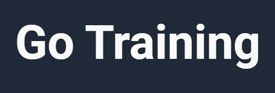
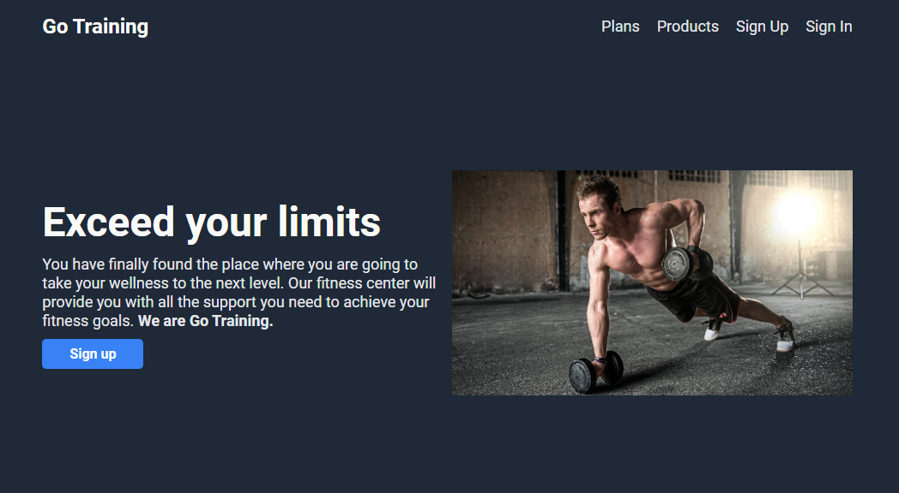

<a name="readme-top"></a>

<!-- PROJECT LOGO -->

<div align="center">

[![Contributors][contributors-shield]][contributors-url]
[![Forks][forks-shield]][forks-url]
[![Stargazers][stars-shield]][stars-url]
[![Issues][issues-shield]][issues-url]
[![LinkedIn][linkedin-shield]][linkedin-url]

<br />
<br />

  <a href="https://silveiraguilherme.github.io/go-training/index.html">
    
  </a>

  <p align="center">
    Go Training Fitness Center
    <br />
    <a href="https://silveiraguilherme.github.io/go-training/index.html">View Demo</a>
    ·
    <a href="https://github.com/SilveiraGuilherme/go-training/issues/new">Report Bug</a>
  </p>
</div>

<br/>
<!-- TABLE OF CONTENTS -->
<details>
  <summary>Table of Contents</summary>
  <ol>
    <li>
      <a href="#about-the-project">About The Project</a>
      <ul>
        <li><a href="#built-with">Built With</a></li>
      </ul>
    </li>
    <li>
      <a href="#getting-started">Getting Started</a>
      <ul>
        <li><a href="#installation">Installation</a></li>
      </ul>
    </li>
    <li><a href="#usage">Usage</a></li>
    <li><a href="#roadmap">Roadmap</a></li>
    <li><a href="#contributing">Contributing</a></li>
    <li><a href="#license">License</a></li>
    <li><a href="#contact">Contact</a></li>
    <li><a href="#links">Links</a></li>
  </ol>
</details>

<br/>

<!-- ABOUT THE PROJECT -->

## About The Project

[](https://silveiraguilherme.github.io/go-training/index.html)

<!-- WEBSITE DESCRIPTION -->

This is a fictitious gym's website called Go Training.

### Built With

- <strong>HTML5</strong> as a general stack to build web applications.
- <strong>CSS3</strong> for UI styling.

<!-- GETTING STARTED -->

## Getting Started

To get and run a local copy of this project follow the instructions below.

### Installation

1. Clone the repo
   ```sh
   git clone https://github.com/SilveiraGuilherme/go-training.git
   ```
2. Run the project locally with Live Server

<!-- ROADMAP -->

## Roadmap

- [x] Home page
- [x] Plans page
- [x] Products page
- [x] Sign Up page
- [x] Sign Up successful page
- [x] Sign In page
- [x] Sign In successful page

See the [open issues](https://github.com/SilveiraGuilherme/go-training/issues) for a full list of proposed features (and known issues).

<!-- CONTRIBUTING -->

## Contributing

Contributions are what make the open source community such an amazing place to learn, inspire, and create. Any contributions you make are **greatly appreciated**.

If you have a suggestion that would make this better, please fork the repo and create a pull request. You can also simply open an issue with the tag "enhancement".
Don't forget to give the project a star! Thanks again!

1. Fork the Project
2. Create your Feature Branch (`git checkout -b feature/AmazingFeature`)
3. Commit your Changes (`git commit -m 'Add some AmazingFeature'`)
4. Push to the Branch (`git push origin feature/AmazingFeature`)
5. Open a Pull Request

<!-- CONTACT -->

## Author

[Guilherme Silveira](https://silveiraguilherme.github.io/SilveiraGuilherme/) |
[LinkedIn](https://linkedin.com/in/jsguilherme)

<!-- RESOURCES -->

## Links

- GitHub repository: [https://github.com/SilveiraGuilherme/go-training](https://github.com/SilveiraGuilherme/go-training)
- Website: [go-training](https://silveiraguilherme.github.io/go-training/index.html)

<p align="right">(<a href="#readme-top">back to top</a>)</p>

<!-- MARKDOWN LINKS & IMAGES -->
<!-- https://www.markdownguide.org/basic-syntax/#reference-style-links -->

[contributors-shield]: https://img.shields.io/github/contributors/SilveiraGuilherme/go-training.svg?style=for-the-badge
[contributors-url]: https://github.com/SilveiraGuilherme/go-training/graphs/contributors
[forks-shield]: https://img.shields.io/github/forks/SilveiraGuilherme/go-training.svg?style=for-the-badge
[forks-url]: https://github.com/SilveiraGuilherme/go-training/network/members
[stars-shield]: https://img.shields.io/github/stars/SilveiraGuilherme/go-training.svg?style=for-the-badge
[stars-url]: https://github.com/SilveiraGuilherme/go-training/stargazers
[issues-shield]: https://img.shields.io/github/issues/SilveiraGuilherme/go-training.svg?style=for-the-badge
[issues-url]: https://github.com/SilveiraGuilherme/go-training/issues
[linkedin-shield]: https://img.shields.io/badge/-LinkedIn-black.svg?style=for-the-badge&logo=linkedin&colorB=555
[linkedin-url]: https://linkedin.com/in/jsguilherme
